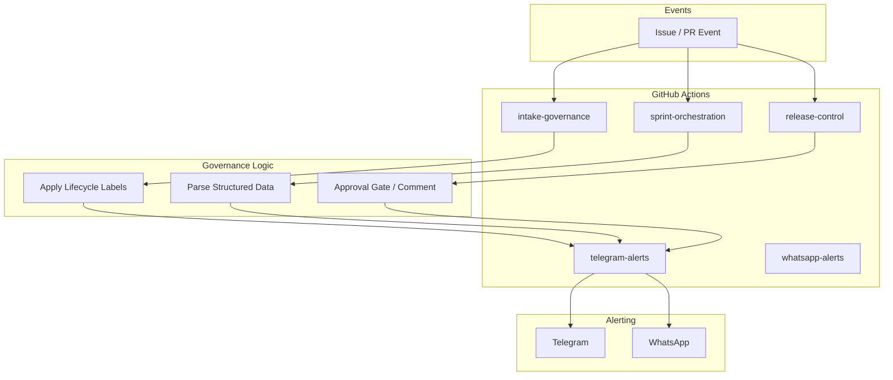

# Architecture

## Overview

The GitHub-native Delivery Operating System is a **reusable workflow library** that integrates into consumer repositories via `workflow_call`. Consumer repos add thin trigger workflows; the Delivery OS workflows run in the consumer's context. No paid third-party dashboards. Non-destructive, additive, versioned.

## Design Principles

| Principle | Implementation |
|-----------|----------------|
| **Event-driven** | Workflows trigger on GitHub events (issues, PRs, labels) |
| **Label-based governance** | Lifecycle stages enforced via labels: `intake`, `bug`, `sprint`, `qa`, `production`, `risk`, `approved`, `rejected` |
| **Structured intake** | YAML issue forms with required fields for features, bugs, sprints, releases |
| **Controlled gates** | Production release requires approval comment and governance summary |
| **Real-time visibility** | Telegram and WhatsApp alerts on key events |
| **Scalable & replicable** | Copy `.github/` and `docs/` to any repository |

## System Diagram



## Component Overview

### Reusable Workflows (workflow_call)

| Workflow | Purpose |
|----------|---------|
| `intake-governance` | Apply intake label, post governance acknowledgment |
| `sprint-orchestration` | Parse deliverables; optionally create child issues (disabled by default), post health summary |
| `release-control` | Parse sprint ref and QA rec, post approval gate, mention approver; optional alerts |
| `telegram-alerts` | Send formatted alert to Telegram |
| `whatsapp-alerts` | Send formatted alert via Meta or Twilio WhatsApp |

Consumer repos create trigger workflows with `on: issues`, `pull_request`, etc., and call these via `uses: org/repo/.github/workflows/<name>.yml@v1`.

### Modular Alerting

Telegram and WhatsApp alerts are **optional, disabled by default**, and run as separate jobs with `continue-on-error: true`. They never block governance. Enable via `enable_telegram` and `enable_whatsapp` inputs.

### Issue Templates

| Template | Labels | Purpose |
|----------|--------|---------|
| `delivery-intake` | `intake` | Feature requests and bug reports (combined) |
| `bug-report` | `intake`, `bug` | Bug reports with steps to reproduce, environment, current/expected behavior |
| `sprint-planning` | `intake`, `sprint-planning` | Sprint creation with line-item deliverables |
| `risk-review` | `intake`, `risk`, `production` | Production release request with QA recommendation |
| `qa-request` | `intake`, `qa` | QA review request with QA Reviewer username |
| `release-approval` | `intake`, `production`, `risk` | Release approval with Release Approver username |

### Lifecycle Labels

```
intake → sprint → qa → production → approved / rejected
  bug      risk
```

## Data Flow

1. **Intake**: User submits issue via form → `intake` label applied → governance comment posted.
2. **Sprint**: User creates sprint issue → `sprint-planning` label → workflow parses body → (if enabled) child issues created → health summary posted.
3. **Release**: User adds `production` label → workflow parses sprint ref and QA rec → approval comment with @release-approver → merge blocked until approval.
4. **Alerts**: Key events trigger Telegram and WhatsApp notifications with event type, repo, title, link.

## Security Model

- **Secrets**: All tokens (Telegram, WhatsApp, Twilio) stored as `${{ secrets.* }}`; never hardcoded.
- **Placeholders**: Use `@release-approver` and generic examples; no personal usernames or org names.
- **Public-safe**: Repository content is suitable for public release.

---

## Further Reading

For a full technical specification, see **[System Design](system-design.md)** — component deep dives, data flows, state machines, failure modes, and sequence diagrams.
