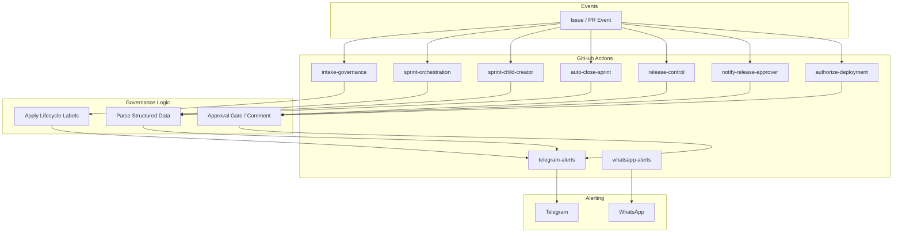

# Architecture

## Overview

The GitHub-native Delivery Operating System is a **reusable workflow library** that integrates into consumer repositories via `workflow_call`. Consumer repos add thin trigger workflows; the Delivery OS workflows run in the consumer's context. No paid third-party dashboards. Non-destructive, additive, versioned.

## Design Principles

| Principle | Implementation |
|-----------|----------------|
| **Event-driven** | Workflows trigger on GitHub events (issues, PRs, labels, comments) |
| **Label-based governance** | Lifecycle stages enforced via labels: `intake`, `bug`, `sprint`, `planning`, `task`, `qa`, `qa-request`, `production`, `release`, `approval`, `ready-for-deploy` |
| **Structured intake** | YAML issue forms with required fields for sprints, tasks, bugs, QA, releases |
| **Controlled gates** | Production release requires approval; dual approval (release approver + QA lead) optional |
| **Real-time visibility** | Telegram and WhatsApp alerts on key events |
| **Scalable & replicable** | Copy `.github/` and `docs/` to any repository |

## System Diagram


```mermaid
flowchart TD
    subgraph Events
        A[Issue / PR Event]
    end
    
    subgraph GitHub["GitHub Actions"]
        B[intake-governance]
        C[sprint-orchestration]
        C2[sprint-child-creator]
        D[release-control]
        D2[notify-release-approver]
        D3[authorize-deployment]
        E[auto-close-sprint]
        F[telegram-alerts]
        G[whatsapp-alerts]
    end
    
    subgraph Governance["Governance Logic"]
        H[Apply Lifecycle Labels]
        I[Parse Structured Data]
        J[Approval Gate / Comment]
    end
    
    subgraph Notifications["Alerting"]
        K[Telegram]
        L[WhatsApp]
    end
    
    A --> B
    A --> C
    A --> C2
    A --> D
    A --> D2
    A --> D3
    A --> E
    
    B --> H
    C --> I
    C2 --> I
    D --> J
    D2 --> J
    D3 --> J
    E --> I
    
    H --> F
    I --> F
    J --> F
    
    F --> K
    G --> L
```

## Component Overview

### Reusable Workflows (workflow_call)

| Workflow | Purpose |
|----------|---------|
| `intake-governance` | Apply intake label, post governance acknowledgment |
| `sprint-orchestration` | Parse Sprint Features; optionally create child issues (disabled by default), post health summary |
| `sprint-child-creator` | Create child issues when sprint issue opened (title "SPRINT -") |
| `release-control` | Parse sprint ref and QA rec, post approval gate, mention approver; optional alerts |
| `notify-release-approver` | Ping release approver when production release issue opened |
| `authorize-deployment` | Dual approval (release approver + QA lead) before `ready-for-deploy` |
| `auto-close-sprint` | Update burn-down, auto-close sprint when 100% complete |
| `telegram-alerts` | Send formatted alert to Telegram |
| `whatsapp-alerts` | Send formatted alert via Meta or Twilio WhatsApp |

Consumer repos create trigger workflows with `on: issues`, `pull_request`, `issue_comment`, etc., and call these via `uses: org/repo/.github/workflows/<name>.yml@main`.

### Modular Alerting

Telegram and WhatsApp alerts are **optional, disabled by default**, and run as separate jobs with `continue-on-error: true`. They never block governance. Enable via `enable_telegram` and `enable_whatsapp` inputs.

### Issue Templates

| Template | Labels | Purpose |
|----------|--------|---------|
| `sprint-planning` | `sprint`, `planning`, `sprint-planning` | Sprint creation with features (one per line), goal, approval status |
| `task` | `task` | Structured tasks with priority, status, acceptance criteria |
| `bug-report` | `bug`, `qa` | Bug reports with platform, severity, steps to reproduce |
| `qa-request` | `qa-request` | QA testing request for sprint tasks or bug fixes |
| `production-release-qa-signoff` | `release`, `production`, `approval` | Production release governance & QA sign-off |
| `config` | — | Blank issues, contact links |

### Lifecycle Labels

```
intake → sprint → qa → production → approved / rejected
  bug      planning    qa-request    release
  task                 approval      ready-for-deploy
```

## Data Flow

1. **Intake**: User submits issue via form → `intake` label applied → governance comment posted.
2. **Sprint**: User creates sprint issue (title "SPRINT -") → sprint-child-creator or sprint-orchestration parses body → (if enabled) child issues created → health summary posted.
3. **Sprint progress**: Child issue closed → auto-close-sprint updates burn-down → sprint auto-closed when 100%.
4. **Release**: User creates production release issue or adds `production` label → release-control parses sprint ref and QA rec → approval comment → notify-release-approver pings approver.
5. **Dual approval**: Both approvers comment approval → authorize-deployment adds `ready-for-deploy`.
6. **Alerts**: Key events trigger Telegram and WhatsApp notifications with event type, repo, title, link.

## Security Model

- **Secrets**: All tokens (Telegram, WhatsApp, Twilio) stored as `${{ secrets.* }}`; never hardcoded.
- **Placeholders**: Use `@release-approver` and generic examples; no personal usernames or org names.
- **Configurable approvers**: Release approver and QA lead usernames passed as workflow inputs.
- **Public-safe**: Repository content is suitable for public release.

---

## Further Reading

For a full technical specification, see **[System Design](system-design.md)** — component deep dives, data flows, state machines, failure modes, and sequence diagrams.
