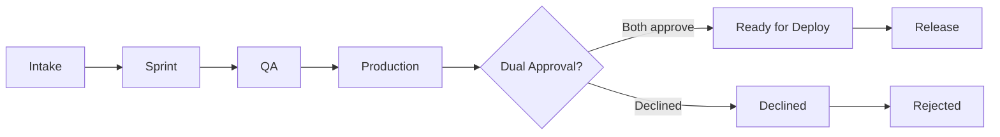

# Governance & Lifecycle

## Philosophy

The Delivery Operating System is built on four principles:

1. **Visibility drives accountability** — Sprint progress and release requests are tracked in GitHub.
2. **Accountability drives quality** — Structured forms and required fields ensure nothing slips through.
3. **Quality protects production** — Approval gates and QA recommendations guard production releases.
4. **Structured delivery reduces risk** — Standardized workflows and labels make delivery predictable.

---

## Lifecycle Stages

| Stage | Labels | Description |
|-------|---------|-------------|
| Intake | `intake` | New item; awaiting triage |
| Bug | `bug`, `qa` | Bug report (template auto-applies) |
| Task | `task` | Structured task |
| Sprint | `sprint`, `planning` | Sprint planning issue |
| Sprint task | `sprint-active` | Child issue (workflow adds) |
| QA | `qa`, `qa-request` | QA testing requested |
| Production | `production`, `release`, `approval` | Release candidate (template auto-applies) |
| Ready | `ready-for-deploy` | Dual approval received (workflow adds) |
| Declined | `declined` | Release declined (workflow adds) |

---

## Approval Gates

### Production Release

When a production release issue is opened (template auto-applies `production`):

1. **notify-release-approver** pings `RELEASE_APPROVER` with sprint reference and QA recommendation.
2. Approver reviews and comments.

### Dual Approval

**authorize-deployment** listens for comments on production issues:

| Approver | Keywords to approve | Keywords to decline |
|----------|---------------------|---------------------|
| Release (`RELEASE_APPROVER`) | `approved`, `approve`, `ok`, `go ahead` | `declined`, `reject`, `not approved` |
| QA (`QA_APPROVER`) | `qa approved`, `approved`, `qa ok`, `looks good` | — |

Both must approve → `ready-for-deploy` label. Release approver can decline → `declined` label.

---

## Automation Rules

| Event | Workflow | Action |
|-------|----------|--------|
| Sprint issue opened (title "SPRINT -") | sprint-child-creator | Creates child issues with `sprint-active` |
| Child issue closed (body has Parent Sprint) | auto-close-sprint | Updates burn-down; auto-closes at 100% |
| Production release opened | notify-release-approver | Pings RELEASE_APPROVER |
| Comment on production issue | authorize-deployment | Dual approval → ready-for-deploy |
| QA/qa-request issue opened | auto-assign-qa | Assigns QA_ASSIGNEES |
| Bugs, QA, sprints, releases, PR merged | telegram-issues | Sends alerts (if secrets set) |

---

## Workflow Triggers

| Workflow | Trigger |
|----------|---------|
| sprint-child-creator | `issues.opened` (title contains "SPRINT -") |
| auto-close-sprint | `issues.closed` (body contains "Parent Sprint") |
| notify-release-approver | `issues.opened` (label `production`) |
| authorize-deployment | `issue_comment.created` (on production issue) |
| auto-assign-qa | `issues.opened` or `labeled` (label `qa` or `qa-request`) |
| telegram-issues | `issues`, `issue_comment`, `pull_request` |
