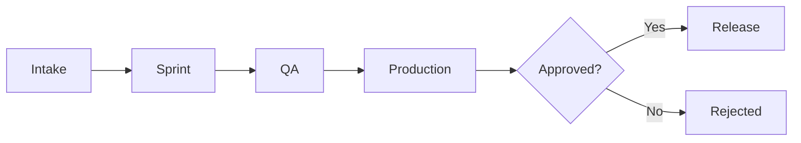

# Release Lifecycle

## Overview

The release lifecycle in the Delivery Operating System flows from intake through sprint execution to production approval. Each stage is governed by labels and workflows.

## Stages



### 1. Intake

- User submits issue via **Delivery Intake**, **Bug Report**, **Sprint Planning**, **Risk Review**, **QA Request**, or **Release Approval** form.
- `intake` label applied automatically (Bug Report also applies `bug` for triage).
- Governance acknowledgment comment posted.

### 2. Sprint

- For sprint planning: add `sprint-planning` label.
- Workflow parses deliverables (one per line).
- If child task creation is enabled: creates child issues, optionally assigns milestone, posts health summary. Child issues receive `intake` and `sprint` labels.
- If disabled (default): validates label only; no child creation.

### 3. QA

- Assign `qa` label when item enters quality assurance.
- QA team reviews and documents recommendation (Approve / Reject / Conditional).

### 4. Production

- Assign `production` label to issue or PR.
- **Release Control** workflow triggers:
  - Parses sprint reference (#number)
  - Parses QA recommendation
  - Posts approval gate comment
  - Mentions @release-approver

### 5. Approval

- Release approver reviews and comments "Approved for production" or "Release approved".
- Merge can proceed once approval is recorded.
- Branch protection can enforce this via required reviews.

### 6. Post-Release

- Optional Telegram and WhatsApp alerts sent on key events (PR merged, production label added) when enabled in trigger workflows.
- Labels can be updated to `approved` or `rejected` for audit trail.

## Sprint Reference Format

In release requests, reference the sprint planning issue by number:

```
Sprint Reference: #12
```

Or in the Risk Review form field: `#12`

## QA Recommendation Format

Use one of:

- **Approve** — Ready for production
- **Reject** — Do not release
- **Conditional** — Release only if conditions are met (document in comments)

## Workflow Triggers

| Workflow | Trigger |
|----------|---------|
| intake-governance | `issues` / `pull_request` opened, edited, labeled |
| sprint-orchestration | `issues` opened, edited (with `sprint-planning` label) |
| release-control | `issues` / `pull_request` labeled with `production` |
| telegram-alerts | PR merged; `production`, `sprint-planning`, `risk` labels |
| whatsapp-alerts | PR merged; `production` label |
