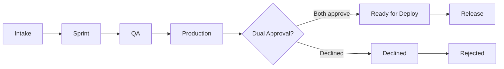

# Release Lifecycle

## Overview

The release lifecycle in the Delivery Operating System flows from intake through sprint execution to production approval. Each stage is governed by labels and workflows.

## Stages


```mermaid
flowchart LR
    A[Intake] --> B[Sprint]
    B --> C[QA]
    C --> D[Production]
    D --> E{Dual Approval?}
    E -->|Both approve| F[Ready for Deploy]
    E -->|Declined| G[Declined]
    F --> H[Release]
    G --> I[Rejected]
```

### 1. Intake

- User submits issue via **Sprint Planning**, **Task**, **Bug Report**, **QA Request**, or **Production Release & QA Sign-Off** form.
- `intake` label applied automatically (Bug Report also applies `bug` and `qa` for triage).
- Governance acknowledgment comment posted.

### 2. Sprint

- For sprint planning: create issue with title "SPRINT -" or add `sprint-planning` / `planning` label.
- **Sprint Child Creator** (standalone): Creates child issues immediately when sprint issue opened (title "SPRINT -").
- **Sprint Orchestration** (alternative): If `enable_child_task_creation` is true, parses Sprint Features (one per line) and creates child issues. Child issues receive `intake` and `sprint` labels. Body includes `Parent Sprint: #N`.
- **Auto Close Sprint**: When child issues are closed, burn-down updates; sprint auto-closes when 100% complete.

### 3. QA

- Assign `qa` or `qa-request` label when item enters quality assurance.
- QA team reviews and documents recommendation (Approve for Production / Reject Release / Conditional Approval).

### 4. Production

- Create issue via **Production Release & QA Sign-Off** (labels `release`, `production`, `approval`) or add `production` label to existing issue.
- **Release Control** workflow triggers:
  - Parses sprint reference (#number)
  - Parses QA recommendation
  - Posts approval gate comment
  - Mentions @release-approver (from workflow input)
- **Notify Release Approver** (optional): Pings approver when production release issue opened.

### 5. Approval

**Single approval:**
- Release approver reviews and comments "Approved for production" or "Release approved".
- Merge can proceed once approval is recorded.

**Dual approval (optional):**
- Both release approver and QA lead must comment approval.
- Release approver can decline with "declined", "reject", or "not approved".
- Once both approve, `ready-for-deploy` label applied.

### 6. Post-Release

- Optional Telegram and WhatsApp alerts sent on key events (PR merged, production label added) when enabled in trigger workflows.
- Labels can be updated to `approved` or `rejected` for audit trail.

## Sprint Reference Format

In release requests, reference the sprint planning issue by number:

```
Sprint Reference: #45
```

## QA Recommendation Format

Use one of:

- **Approve for Production** — Ready for production
- **Reject Release** — Do not release
- **Conditional Approval** — Release only if conditions are met (document in comments)

## Workflow Triggers

| Workflow | Trigger |
|----------|---------|
| intake-governance | `issues` / `pull_request` opened, edited, labeled |
| sprint-child-creator | `issues` opened (title "SPRINT -") |
| sprint-orchestration | `issues` opened, edited, labeled (with `sprint-planning` or `planning`) |
| auto-close-sprint | `issues` closed (child with Parent Sprint) |
| release-control | `issues` opened (with production) / `issues` / `pull_request` labeled with `production` |
| notify-release-approver | `issues` opened (with production label) |
| authorize-deployment | `issue_comment` created (on production issue) |
| telegram-alerts | PR merged; `production`, `sprint-planning`, `risk` labels |
| whatsapp-alerts | PR merged; `production` label |
